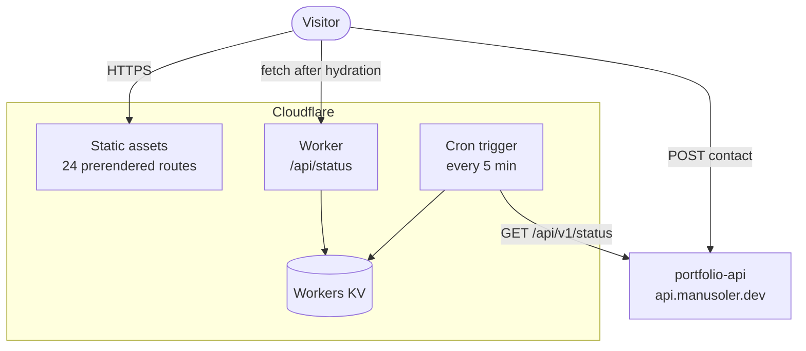

<div align="center">

# Portfolio - Web

**Angular 21 site at [manusoler.dev](https://manusoler.dev)**

My portfolio: prerendered, bilingual, served from Cloudflare's edge, with a live panel
showing the state of the server I run at home.

<br>

[](https://manusoler.dev)
[](https://github.com/ManusolJ/portfolio-api)

[](https://angular.dev/)
[](https://www.typescriptlang.org/)
[](https://tailwindcss.com/)
[](https://vitest.dev/)
[](https://workers.cloudflare.com/)

[](https://github.com/ManusolJ/portfolio-web/actions)
[](https://github.com/ManusolJ/portfolio-web/commits)

<a href="#what-it-is">What it is</a> ·
<a href="#architecture">Architecture</a> ·
<a href="#design-decisions">Design decisions</a> ·
<a href="#tech-stack">Tech stack</a> ·
<a href="#running-it-locally">Running it</a> ·
<a href="#testing">Testing</a> ·
<a href="#deployment">Deployment</a> ·
<a href="#project-status-and-roadmap">Roadmap</a>

</div>

> [!TIP]
> The monitoring, telemetry and contact delivery behind the homelab panel are documented in
> the [API repository](https://github.com/ManusolJ/portfolio-api).

---

## What it is

Nine routes - about, education, experience, skills, projects, a detail page per project,
the homelab panel, contact and a 404 - built twice, once per locale, and prerendered to
static HTML at build time. There is no server rendering at runtime: Cloudflare serves files,
and a small Worker handles the one dynamic route.

The most interesting parts:

**The homelab panel** (`/homelab`) reads live data from my server: CPU, memory, disk, load,
uptime and temperature, plus 90 days of uptime bars per monitored service and the most
recent incident. When the server is unreachable it shows the last known reading with the
time contact was lost, and mutes every status dot so nothing claims to be online on stale
data.

**The contact form** posts to the API with a honeypot field, a disabled state while in
flight, and distinct messages for "too many messages" and everything else - with my address
visible as a fallback either way.

**Both locales** are real builds, not a runtime switch: `/es/` and `/en/` are separate
bundles with their own prerendered HTML, `hreflang` alternates and per-route metadata.

---

## Architecture



The site never waits on my server. A cron trigger polls the API every five minutes and
stores the answer in KV; the page reads that copy from the nearest edge location in about
50 ms whether the homelab is up, down or unplugged.

### Project structure

```
src/app/
  core/services/     ThemeStore, SeoTitleStrategy, ContactSender, ServerStatusReader
  layout/            sidebar, dock, panel - rendered once, never routed
  features/          one folder per route
  shared/            components, models and constants that could move to another project
worker/              the edge worker: cron poll, KV cache, /api/status
root/                robots.txt, _redirects, 404.html, og.png - copied to the assets root
scripts/postbuild.mjs  generates sitemap.xml and _headers (CSP with inline-script hashes)
```

---

## Design decisions

### Prerendered, not server-rendered

Every route is static HTML, so a link preview bot sees real content and the site cannot
break because a server is down. The cost is that no page can embed live data at build time -
which is why the panel fetches after hydration.

### The edge worker instead of a committed snapshot

The first idea I had for "what if the server is down" was committing a `snapshot.json` and
regenerating it by hand. Then I found out about the Worker KV and its better in every aspect so I implemented it.

### A CSP with hashes, generated at build time

`scripts/postbuild.mjs` walks the prerendered output, hashes every inline script and writes
a `_headers` file with the matching `script-src` entries. Adding an inline script without
rebuilding breaks the page loudly, which is the intended failure mode.

### Theme applied before the bundle loads

An inline script in `index.html` stamps `data-theme` on `<html>` from `localStorage` before
Angular boots. A template cannot branch on the stored theme - the prerendered HTML has no
idea what a visitor prefers - so doing it in CSS avoids a hydration mismatch and a flash of
the wrong palette.

### Translations in XLF, with the build failing loudly

Strings are `$localize` with explicit namespaced ids. Both locales build from
`messages.en.xlf`; an untranslated id falls back to Spanish with a warning, and the
extraction step is part of the workflow rather than an afterthought.

---

## Tech stack

| Layer     | Choice                                                                |
| --------- | --------------------------------------------------------------------- |
| Framework | Angular 21, zoneless, `OnPush` everywhere, signals                    |
| Rendering | `outputMode: "static"` - 24 prerendered routes (12 pages × 2 locales) |
| Styling   | Tailwind CSS 4 with design tokens in `styles.css`                     |
| i18n      | `@angular/localize`, Spanish source, English XLF                      |
| Icons     | `@ng-icons` - Lucide, Tabler, Devicon                                 |
| Tests     | Vitest via `@angular/build:unit-test`                                 |
| Edge      | Cloudflare Workers, Workers KV, cron triggers                         |
| Tooling   | ESLint with perfectionist, Prettier, Wrangler                         |

---

## Running it locally

```bash
git clone https://github.com/ManusolJ/portfolio-web.git
cd portfolio-web
npm install
npm start
```

Opens on `http://localhost:4200` with `/api` proxied to the worker on port 8787.

| Script                 | Purpose                                        |
| ---------------------- | ---------------------------------------------- |
| `npm start`            | Dev server (Spanish)                           |
| `npm run start:en`     | Dev server with the English bundle             |
| `npm run build`        | Production build, then `postbuild.mjs`         |
| `npm run dev:worker`   | The real Workers runtime over the built output |
| `npm run check:worker` | Regenerate worker types and type-check them    |
| `npm run extract-i18n` | Re-extract `messages.xlf`                      |
| `npm test`             | Vitest                                         |

`ng serve` never prerenders, so only `npm run build` exercises what is actually deployed.
To test the panel end to end, build, run `npm run dev:worker`, and fire the cron manually:

```bash
curl "localhost:8787/cdn-cgi/local/scheduled?cron=*/5+*+*+*+*"
```

---

## Testing

```bash
npm run lint && npm run format:check && npm test && npm run build
```

The build is part of the gate because `tsc` does not type-check templates - only `ng build`
sees template errors, and only a build proves the routes prerender.

---

## Deployment

Pushing to `main` triggers Cloudflare Workers Builds, which runs the production build and
deploys the assets and the worker together. CI runs in parallel on GitHub Actions: lint,
format, worker type-check, tests, build.

The deployed unit is static files plus one Worker script, with a cron trigger and a KV
namespace bound to it. `_headers` carries the CSP and cache policy; `_redirects` sends `/`
to the default locale.

---

## Project status and roadmap

Live. The remaining work, in the order I intend to tackle it:

- [ ] **CV semantic search UI.** A search box over my CV backed by embeddings, with a
      keyword fallback in the browser when the API is unreachable - and a label saying which
      mode answered.
- [ ] **Case studies** for Poketeam, Necobot and the homelab: problem, architecture,
      trade-offs, and what I would do differently.
- [ ] **A recorded walkthrough** of Poketeam, encoded as AV1/WebM with an H.264 fallback.
- [ ] **A GitHub activity feed**, proxied and cached through the API.
- [ ] **Latency sparklines** on the homelab panel - the API already returns 24 hours of
      five-minute averages that nothing renders yet.
- [ ] **Lighthouse ≥ 95** on both locales, plus an axe pass.
- [ ] **More component tests.** Coverage is thin: the root component and the panel's
      degraded state.

---

<div align="center">

### Author

**Manuel Soler Juan** - Junior full stack developer

[](https://github.com/ManusolJ)
[](https://linkedin.com/in/manusolerj)

</div>
